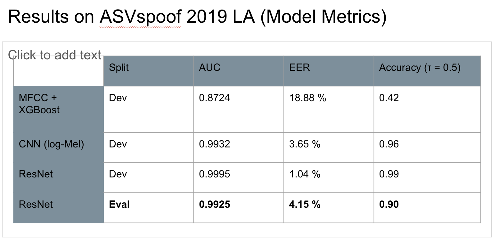

To study automatic detection of synthetic speech, I implemented three progressively more powerful models on top of the ASVspoof 2019 LA corpus, all operating at the utterance level.

MFCC + XGBoost (classical baseline).
As a purely hand-crafted baseline, I extracted 20 Mel-frequency cepstral coefficients (MFCCs) per frame from 16 kHz audio using a 25 ms window and 10 ms hop. First- and second-order temporal derivatives (Δ, ΔΔ) were computed, resulting in 60 coefficients per frame. For each utterance, I then aggregated simple statistics (mean, standard deviation, minimum, maximum) over time for each coefficient, yielding a 240-dimensional fixed-length feature vector. A gradient boosting classifier (XGBoost, objective binary:logistic) was trained on these vectors to discriminate between bonafide (real) and spoof (fake) speech.

CNN on log-Mel spectrograms.
As a first deep learning baseline, I moved from global MFCC statistics to time–frequency “images”. Each utterance was first cropped or padded to a fixed 3 s segment. I then computed a 64-band Mel spectrogram using a 512-point STFT (25 ms window, 10 ms hop) and took the natural logarithm of the Mel energies. Each log-Mel spectrogram was normalised per utterance (zero mean, unit variance) and fed as a single-channel image of shape (1,F,T) into a small convolutional neural network (three convolutional blocks with batch normalisation, max-pooling and dropout, followed by a fully connected layer and a single logit output). This model learns convolutional filters directly on the time–frequency representation instead of relying on hand-crafted MFCC statistics.

ResNet-style CNN on log-Mel spectrograms.
The best-performing model is a deeper ResNet-style network using exactly the same 3 s log-Mel inputs as the CNN baseline. The architecture begins with a convolutional stem (3×3 conv, batch normalisation, ReLU), followed by four residual stages. Each stage consists of two BasicBlock residual units (3×3 conv–BN–ReLU–3×3 conv–BN with an identity or 1×1-conv shortcut), with stride 2 in the first block of a stage to progressively downsample the time–frequency resolution. After the final stage, I apply global average pooling over both time and frequency, a fully connected layer with dropout, and a final linear layer producing a single logit. The residual connections help optimisation in the deeper network and allow the model to learn more complex spoof artefacts while keeping the parameter count moderate.

In all deep learning models, labels are binary with 0 = bonafide and 1 = spoof, and training uses the binary cross-entropy loss with logits.

Evaluation protocol and metrics

I follow the official ASVspoof 2019 LA protocol:

Training set (TRAIN) is used exclusively to fit model parameters.

Development set (DEV) is used for model selection, hyperparameter tuning, and early stopping.

The evaluation set (EVAL) is reserved for future final testing and is not used in the current development experiments.

Due to the strong class imbalance in ASVspoof LA (approximately 10 % bonafide vs 90 % spoof), simple accuracy is not informative. Instead, I use two standard metrics from the spoofing and biometrics literature:

ROC AUC (Area Under the Receiver Operating Characteristic curve).
Each model outputs a continuous score s(x) (converted to a probability via a sigmoid). Varying the decision threshold 𝜏.
τ yields different pairs of false positive rate (FPR, bonafide misclassified as spoof) and true positive rate (TPR, spoofs correctly detected). The ROC curve plots TPR vs. FPR over all thresholds. The AUC summarises this curve in [0,1]; it can be interpreted as the probability that the model assigns a higher score to a random spoof utterance than to a random bonafide utterance. AUC is threshold-independent and robust to class imbalance.

Equal Error Rate (EER).
For each threshold τ, we can compute False Acceptance Rate (FAR, spoofs accepted as bonafide) and False Rejection Rate (FRR, bonafide rejected as spoof). The Equal Error Rate is defined as the operating point where FAR and FRR are equal (or as close as possible). It is obtained empirically from the ROC curve by finding the threshold where FPR and FNR (= 1 − TPR) intersect. EER is expressed as a percentage; lower is better. EER is widely used in ASVspoof to quantify performance at a balanced operating point where both types of error are treated as equally costly.

I ended up with the best model metrics (ResNet CNN) on the Eval set.
Here are the following metrics:
AUC = 0.9925
EER = 4.15%
Accuracy (threshold = 0.5) = 0.90

